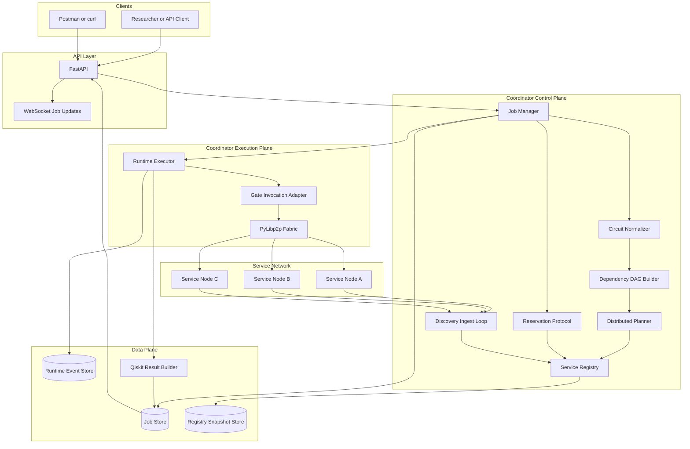
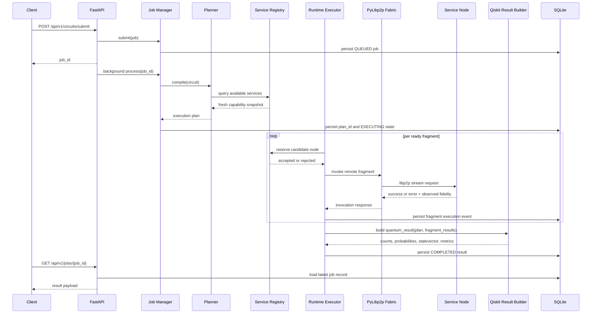
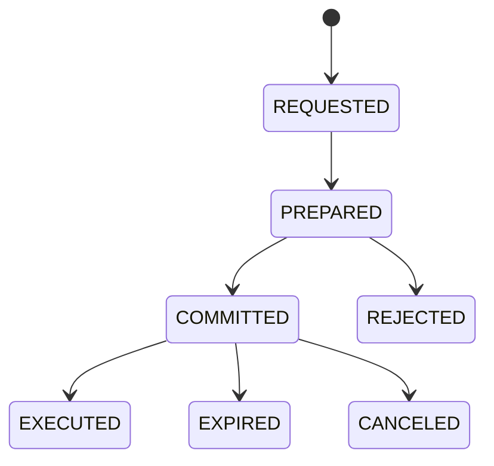
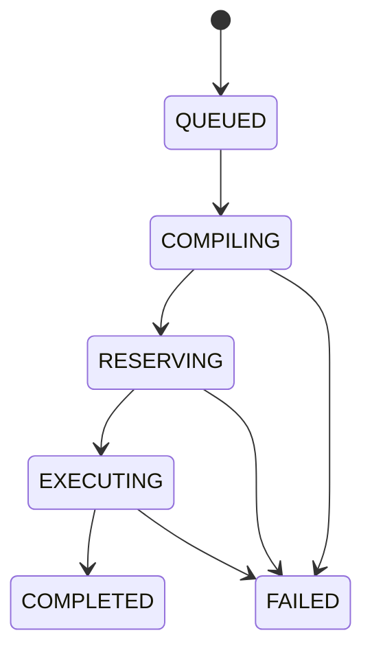

# Architecture: Distributed Quantum Services Over Libp2p

This document explains the system in depth:

- what the coordinator is actually doing
- how distributed quantum services are represented
- how a circuit becomes a routed execution plan
- how libp2p discovery and remote invocation fit into the workflow
- how runtime execution, persistence, and Qiskit analysis connect

If the `README.md` is the front door, this file is the machine room.

## 1. System Thesis

The project treats **quantum capabilities as network services**.
Each service node advertises what it can do, the coordinator builds a view of the available topology, and client-submitted circuits are compiled into a distributed execution plan.

The core research idea is simple:

1. represent quantum operations as distributed services
2. coordinate them over `py-libp2p`
3. preserve execution metadata and quality information
4. compare distributed orchestration against simpler centralized control

That makes this system more than a parser plus simulator. It is a **coordination layer for distributed quantum services**.

## 2. Architectural View

The system is easiest to understand as three connected planes.

### Control Plane

Responsible for deciding what should happen.

- API ingestion
- circuit normalization
- service discovery
- service registry freshness
- planning and assignment
- reservation decisions
- job lifecycle management

### Execution Plane

Responsible for making the distributed work actually happen.

- libp2p pubsub for service advertisements
- libp2p request streams for remote gate execution
- runtime scheduling
- timeout, retry, and fallback logic

### Data Plane

Responsible for making the system inspectable and recoverable.

- SQLite job store
- SQLite runtime event store
- SQLite service registry snapshot
- structured response models
- Qiskit result generation

## 3. Full System Diagram



## 4. The End-to-End Workflow

The best mental model is:

1. a client submits a circuit
2. the coordinator turns it into a dependency-aware plan
3. each fragment is mapped to a service node
4. the runtime reserves and executes fragments in order
5. results and metadata are persisted
6. Qiskit reconstructs the pre-measurement quantum state and analysis payload
7. the API returns both execution metadata and quantum insight

### Sequence Diagram



## 5. Component-by-Component Breakdown

### 5.1 API Layer

The API layer is the user-facing boundary.

Primary responsibilities:

- validate incoming request payloads
- enforce optional API key authentication
- enforce optional in-memory rate limiting
- enqueue background processing
- expose current job status and final results
- expose service and fidelity snapshots
- expose a WebSocket stream for job lifecycle changes

The API is intentionally thin. It does not contain planning or runtime logic. It delegates that work to `JobManager` and related application/runtime services.

#### API endpoints

- `GET /api/v1/health`
- `POST /api/v1/circuits/submit`
- `GET /api/v1/jobs/{job_id}`
- `GET /api/v1/plans/{plan_id}`
- `GET /api/v1/services`
- `GET /api/v1/metrics/fidelity/{node_id}`
- `WS /api/v1/jobs/{job_id}/ws`

### 5.2 Job Manager

The `JobManager` is the top-level orchestration entry point inside the coordinator.

It owns the coarse lifecycle:

```text
QUEUED -> COMPILING -> RESERVING -> EXECUTING -> COMPLETED | FAILED
```

Responsibilities:

- persist jobs immediately on submit
- claim in-flight jobs to avoid duplicate processing
- compile the circuit into an execution plan
- persist lifecycle transitions
- execute the plan
- serialize final runtime results into stable JSON
- recover unfinished jobs at startup

It is effectively the application service boundary between the API and the distributed execution engine.

### 5.3 Service Discovery and Registry

Service nodes periodically advertise capabilities over libp2p pubsub.
The coordinator subscribes to the topic, validates each advertisement, and stores it in a local registry.

Each advertisement includes:

- `node_id`
- `listen_addrs`
- `service_type`
- `fidelity`
- `qubit_min`
- `qubit_max`
- `availability`
- `updated_at`

The registry is the coordinator's local truth for planning decisions.
It is:

- freshness-aware
- queryable by service type and availability
- persisted to SQLite for restart resilience

This is important because the planner should not depend on an external network call every time it evaluates a candidate.
Instead, it plans against a stable, local snapshot of the distributed service landscape.

### 5.4 Circuit Ingestion and Normalization

The planner does not work directly on raw OpenQASM text.
The first step is normalization into a small internal representation.

Current supported input styles:

- OpenQASM 2 style `qreg`
- OpenQASM 3 style `qubit[]`
- project-specific service aliases such as `bell_pair`, `teleport`, and `measure`

Normalization extracts:

- circuit format
- qubit count
- ordered operations
- service type per operation
- qubit operands

This stage is deliberately conservative.
If the parser cannot understand an operation or declaration, it fails fast with a structured error rather than guessing.

### 5.5 Dependency Graph and Fragmentation

After normalization, operations are transformed into a dependency-aware representation.

The essential rule is:

- operations that touch the same qubit are ordered by dependency

That yields a DAG of execution constraints.
The planner then groups operations into fragments, where each fragment carries:

- `fragment_id`
- `service_type`
- `qubits`
- `operation_ids`
- dependency list

This matters because the runtime does not execute "the whole circuit" at once.
It executes ready fragments whose dependencies have already completed.

### 5.6 Distributed Planning

The distributed planner consumes:

- normalized circuit fragments
- current registry snapshot
- planner cost configuration

It produces an `ExecutionPlan` containing:

- `plan_id`
- fragment ordering
- fragment definitions
- candidate service-node assignments
- primary and fallback nodes
- quality snapshot metadata

#### What the planner optimizes

The planner is cost-based, not random.
It scores candidates using components such as:

- latency cost
- failure-risk cost
- entanglement cost
- load cost

The outcome is deterministic for a fixed topology and configuration, which is important for repeatability in a research setting.

### 5.7 Reservation Protocol

Before runtime invocation, the coordinator asks whether a target node is acceptable for the fragment and fidelity threshold.

The reservation layer gives the runtime a place to encode:

- requested service type
- target node
- minimum fidelity
- reservation acceptance or rejection
- cancellation and execution state

Even in this proof of concept, this is an important architectural separation:

- planning answers "where should this go?"
- reservation answers "can I still use this candidate right now?"

That split makes the system more realistic than directly invoking the first matching node.

#### Reservation state model



### 5.8 Runtime Executor

The runtime executor is where the distributed plan becomes actual work.

Responsibilities:

- walk the fragment dependency order
- identify fragments whose dependencies are already satisfied
- reserve a candidate node
- invoke remote execution over libp2p
- retry on transient failure
- switch to fallback nodes when needed
- record detailed runtime events

The runtime does not simply stop on the first issue.
It has explicit behavior for:

- timeout
- execution rejection
- connection drop
- fidelity below threshold

This is the main reliability layer of the coordinator.

### 5.9 PyLibp2p Fabric

The libp2p fabric is the transport substrate for the demo and integration environment.

It manages:

- one coordinator node
- a configurable number of embedded service nodes
- pubsub subscription for service advertisements
- request/response stream handlers for gate execution
- Trio-native libp2p service lifecycles

#### Why it matters

Without this layer, the project would be a local simulation with some network-shaped abstractions.
With it, the coordinator is actually:

- booting libp2p hosts
- exchanging advertisements over pubsub
- dialing peers over multiaddrs
- sending real request payloads over stream protocols

That is the heart of the distributed quantum services story.

### 5.10 Qiskit Result Builder

The runtime result is not limited to "job succeeded".
After fragment execution completes, the plan is translated into a Qiskit circuit and analyzed.

The result payload can include:

- `counts`
- `probabilities`
- `measured_probabilities`
- `statevector`
- `measured_qubits`
- `observable_expectations`
- `reduced_density_matrices`
- `bloch_vectors`
- `entanglement_entropy`
- `fidelity`
- `top_basis_states`

#### Why this stage exists

The distributed runtime produces execution metadata:

- which node ran what
- how many attempts happened
- what fidelity was observed

The Qiskit layer produces quantum analysis:

- what state was implied by the executed plan
- what measurement marginal was sampled
- what observables and subsystem states look like

Together, those two perspectives make the result useful to both systems engineers and quantum researchers.

## 6. What Exactly Is "Distributed Quantum Services" Here?

This phrase has a very specific meaning in this repository.

It does **not** mean:

- a complete quantum internet stack
- a hardware-level entanglement routing layer
- a production cloud orchestration plane for real QPUs

It **does** mean:

- quantum capabilities are exposed as service advertisements
- each capability is attached to a node identity and reachable address
- execution is planned against a distributed service registry
- invocation happens over a peer-to-peer transport
- the coordinator can route different fragments to different service nodes

That is the core architectural claim of the project.

## 7. Detailed Walkthrough of a Typical Request

Consider this input:

```qasm
OPENQASM 3;
qubit[2] q;
bit[1] c;
bell_pair q[0], q[1];
cnot q[0], q[1];
cz q[0], q[1];
teleport q[0], q[1];
syndrome_extraction q[0];
distillation q[1];
measure q[0] -> c[0];
```

### Stage 1: API ingestion

The API accepts the payload, validates size limits, persists a `QUEUED` job, and returns `job_id`.

### Stage 2: normalization

The parser maps operations into supported service types:

- `bell_pair`
- `cnot`
- `cz`
- `teleportation`
- `syndrome_extraction`
- `distillation`
- `measurement_feedforward`

### Stage 3: planning

The planner constructs fragments, evaluates registry candidates, and assigns primary and fallback service nodes.

### Stage 4: execution

The runtime walks ready fragments in dependency order and invokes them over libp2p request streams.

### Stage 5: persistence

Each fragment outcome is written to SQLite with:

- fragment ID
- node ID
- start and finish timestamps
- attempt count
- observed fidelity
- error, if any

### Stage 6: quantum analysis

The executed plan is translated into a Qiskit circuit and analyzed.

For the circuit above, the current model can return data such as:

- measured counts for `q[0]`
- full pre-measurement basis probabilities
- subsystem density matrices
- Bloch vectors per qubit
- expectation values for `Z`, `ZZ`, and `XX`
- top basis states by probability

## 8. Job State Machine



### State meanings

- `QUEUED`: job record exists, execution has not started
- `COMPILING`: circuit is being normalized and planned
- `RESERVING`: runtime is preparing to reserve execution windows
- `EXECUTING`: fragment-level work is actively being invoked
- `COMPLETED`: result JSON is persisted and fetchable
- `FAILED`: planning or execution terminated with a permanent error

## 9. Persistence Model

The system persists more than final outcomes.

### Job store

Stores:

- `job_id`
- raw circuit text
- lifecycle status
- `plan_id`
- error text
- serialized result JSON
- timestamps

### Runtime event store

Stores:

- reservation transitions
- fragment execution events
- attempt-level outcomes
- observed fidelity
- failure reason

### Service registry snapshot store

Stores:

- latest advertisements
- freshness-related timestamps
- availability view used by the planner

This persistence model enables:

- restart recovery
- post-mortem analysis
- demo introspection
- future experiment reporting

## 10. Recovery Model

At startup, the coordinator:

1. runs SQLite migrations
2. restores persisted registry state
3. starts the libp2p fabric
4. starts the discovery ingest loop
5. reloads unfinished jobs
6. reprocesses them through the job manager

This matters because jobs are not just in memory.
If the process restarts mid-run, the system can continue from durable state.

## 11. Result Semantics

The result payload is intentionally split between **execution truth** and **quantum interpretation**.

### Execution truth

Found in `fragment_results`:

- which node executed the fragment
- how many attempts were required
- when each fragment started and finished
- what observed fidelity came back from the service node

### Quantum interpretation

Found in `quantum_result`:

- sampled counts over measured qubits
- full basis probabilities
- statevector
- observables
- subsystem state summaries
- entropy and fidelity estimates

This is important because a distributed orchestration demo should answer both:

- "did the networked execution succeed?"
- "what quantum state and measurements does that imply?"

## 12. Current Modeling Simplifications

This proof of concept makes several explicit simplifications.

### Teleportation

`teleportation` is currently modeled as an ancilla-free logical `SWAP` during Qiskit state evolution.

Why:

- the current DSL does not encode the full teleportation protocol
- there is no explicit ancilla allocation in the input language
- there is no classical correction path represented in the current circuit model

### Syndrome extraction and distillation

These are treated as orchestration-level steps rather than additional unitary evolution.

Why:

- the DSL does not yet encode ancillary qubits
- no stabilizer measurement model exists in the current parser
- no detailed classical feedback loop is represented

### Fidelity to target state

The current `fidelity_to_target_state` is computed against the ideal compiled state produced by the same translated circuit.

Interpretation:

- it is useful as a consistency reference
- it is not yet a real hardware-vs-target fidelity measurement

### Estimated execution fidelity

This is currently derived from fragment-level observed fidelities.

Interpretation:

- it gives a practical runtime quality estimate
- it is not a substitute for hardware tomography

## 13. Reliability and Failure Handling

The coordinator is designed to fail usefully, not silently.

### Behaviors already implemented

- if real libp2p startup fails while enabled, API startup fails
- timeouts are bounded
- retries use bounded exponential backoff
- fallback nodes are attempted when available
- degraded fidelity can terminate execution before a bad result is accepted
- malformed or unsupported circuits fail with structured errors

### Why this matters

A demo of distributed quantum services is only credible if failure modes are explicit.
Silent local fallback or hidden transport degradation would make the system look better than it really is.
This project avoids that when libp2p is enabled.

## 14. Where The Research Story Goes Next

The current implementation already demonstrates:

- distributed service discovery
- distributed planning
- real libp2p transport
- fragment-level orchestration
- persisted runtime telemetry
- Qiskit-backed result interpretation

The next architectural step is not "more endpoints".
It is **comparative evaluation**:

- centralized baseline mode
- repeatable scenario matrix
- controlled latency and degradation injection
- artifact export for paper or proposal-quality reporting

That is how the project moves from "strong systems demo" to "publishable evaluation."

## 15. Summary

This system is a **distributed quantum services coordinator**.

It accepts circuits, discovers remote capabilities, plans against a live network view, reserves distributed resources, executes fragments over libp2p, persists the full lifecycle, and returns both orchestration metadata and quantum analysis.

That combination is the architecture.
