# Distributed Quantum Services

## Presentation Deck

- Research focus: distributed orchestration for quantum-service workflows
- Stack: API service, durable state management, quantum analysis, peer-to-peer coordination
- Thesis: quantum capabilities can be treated as network-visible services and coordinated like a distributed systems problem

---

## The Problem

- Most quantum software assumes one circuit, one backend, one execution context
- That abstraction is useful for algorithm development but weak for networked quantum infrastructure
- Future ecosystems are more likely to involve:
- heterogeneous services
- variable fidelity and availability
- distributed control surfaces
- dynamic routing and recovery requirements

### Research Question

How should a system discover, plan, reserve, execute, and interpret **distributed quantum services** rather than assume one monolithic backend?

---

## Project Thesis

- This project is not primarily a local circuit simulator
- It is a **distributed quantum services coordinator**
- A client submits an OpenQASM-like circuit
- The coordinator discovers service nodes over a peer-to-peer coordination layer
- The circuit is normalized, fragmented, and planned against a live service registry
- Fragments are executed remotely with reservation, retry, and fallback
- Results are persisted and then interpreted through a quantum analysis engine

---

## Layered Architecture

```mermaid
flowchart TB
    subgraph Client Layer
        CLI[CLI]
        SDK[SDK / Research Tools]
        NB[Notebooks / Experiment Pipelines]
        QASM[OpenQASM-like Inputs]
    end

    subgraph API Layer
        API[REST API]
        WS[WebSocket Job Stream]
        SEC[Auth and Rate Limit]
    end

    subgraph Orchestration Core
        JM[Job Manager]
        CN[Circuit Normalizer]
        DAG[DAG Builder]
        PL[Planner]
        RT[Runtime Executor]
    end

    subgraph Coordination Layer
        FAB[Coordination Fabric]
        PUB[PubSub Discovery]
        ADV[Node Advertisement]
        SD[Service Discovery]
    end

    subgraph Distributed Quantum Nodes
        HW[Hardware Node]
        SIM[Simulator Node]
        OPT[Optimizer Node]
        TR[Transpiler Node]
    end

    subgraph Persistence Layer
        JS[(Job Store)]
        RS[(Reservation Store)]
        REG[(Service Registry)]
        EV[(Execution Events)]
    end

    Client Layer --> API Layer
    API Layer --> Orchestration Core
    Orchestration Core --> Coordination Layer
    Coordination Layer --> Distributed Quantum Nodes
    Orchestration Core --> Persistence Layer
    Coordination Layer --> Persistence Layer
```

- Captures the full top-down system structure
- Aligns client interfaces, orchestration logic, distributed coordination, node roles, and persistence

---

## Client Layer and Inputs

- Intended client surfaces:
- SDKs and research tools
- CLI workflows
- notebooks and experiment pipelines
- Current submission contract:
- OpenQASM-like circuit text submitted to the coordinator API
- Current implementation is optimized around OpenQASM-style job submission
- Architecture can sit behind richer front-end tooling and research workflows

---

## API Layer

- Responsibilities:
- circuit submission
- job tracking
- plan inspection
- service discovery queries
- fidelity snapshot queries
- streaming job updates

### Implemented Endpoints

- `GET /api/v1/health`
- `POST /api/v1/circuits/submit`
- `GET /api/v1/jobs/{job_id}`
- `GET /api/v1/plans/{plan_id}`
- `GET /api/v1/services`
- `GET /api/v1/metrics/fidelity/{node_id}`
- `WS /api/v1/jobs/{job_id}/ws`

### Current Controls

- API key authentication
- request rate limiting
- structured operational logging

---

## Why This Matters

- Intersection of distributed systems and quantum information systems
- Relevant to future scientific cyberinfrastructure for heterogeneous quantum resources
- Creates a platform for studying:
- service discovery
- quality-aware placement
- resilient orchestration
- comparative distributed versus centralized control
- Moves the conversation from “can a backend run a circuit?” to “how should distributed quantum capabilities be coordinated?”

---

## System Overview

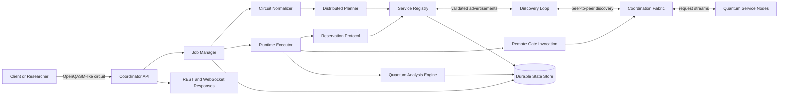

### Key Point

The architecture cleanly separates API ingestion, planning, transport, runtime orchestration, persistence, and quantum interpretation.

---

## Three Planes

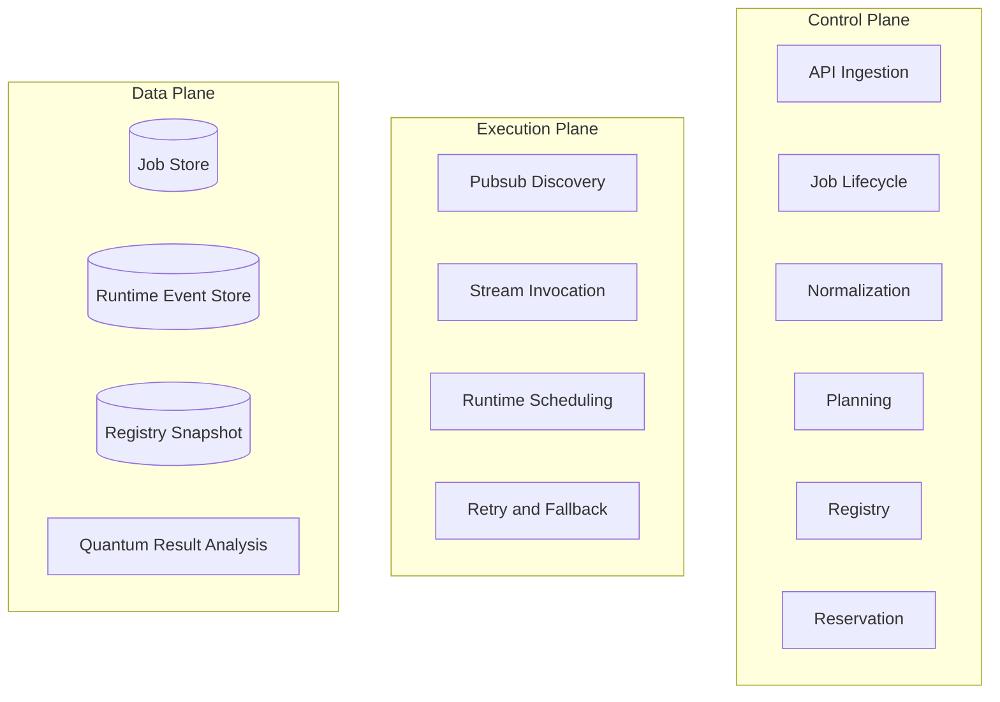

- Control plane decides what should happen
- Execution plane makes distributed work happen
- Data plane makes the system durable, inspectable, and research-ready

---

## End-to-End Workflow

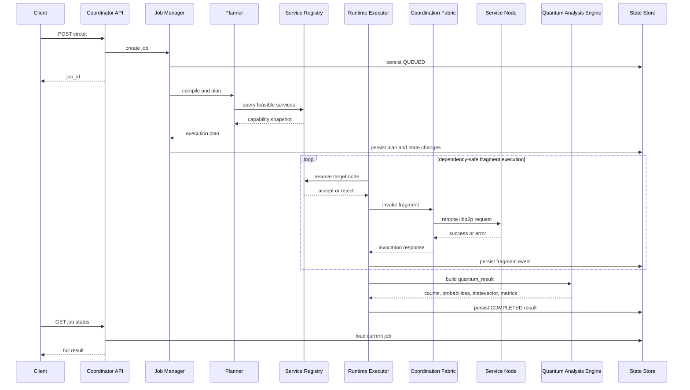

---

## Service Discovery and Registry

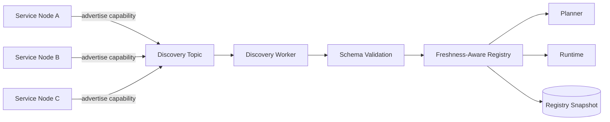

- Advertisements include node ID, service type, fidelity, qubit range, availability, and timestamp
- Registry is the coordinator’s local truth for planning decisions
- Stale entries can be pruned rather than trusted indefinitely

---

## Circuit Compilation Pipeline

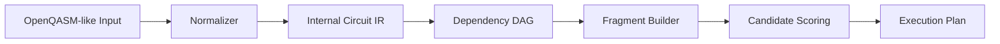

- Input supports OpenQASM 2 and 3 style declarations
- Aliases such as `cx`, `cnot`, `teleport`, and `measure` are normalized
- Output is not raw text but a dependency-aware, routable execution plan

---

## Example Distributed Service Vocabulary

- `bell_pair`
- `cnot`
- `cz`
- `teleportation`
- `syndrome_extraction`
- `distillation`
- `measurement_feedforward`

### Important Framing

- These are service abstractions used for distributed coordination
- Some are direct gate-level mappings
- Some higher-level services are intentionally simplified in the current proof of concept

---

## Distributed Quantum Node Roles

- The architecture can accommodate multiple node roles:
- hardware-backed quantum processing nodes
- simulation nodes
- optimization services
- transpilation and mapping services

### Important Distinction

- Current proof of concept embeds generic service nodes for orchestration and execution validation
- The broader architecture is designed to support richer heterogeneous node roles over time

---

## Planning and Placement Logic

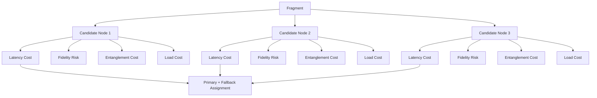

- Planner is deterministic under fixed topology and configuration
- Output preserves primary and fallback assignments
- This is placement logic, not naive dispatch

---

## Runtime Execution Model

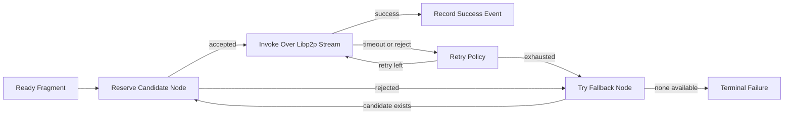

- Runtime respects dependency order
- Handles timeout, rejection, node drop, and degraded quality
- Records fragment-level execution events throughout the run

---

## Job Lifecycle

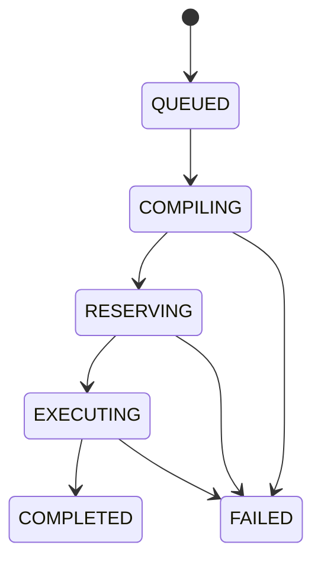

- Every major lifecycle transition is persisted
- Startup recovery can reprocess unfinished jobs

---

## Reservation Lifecycle

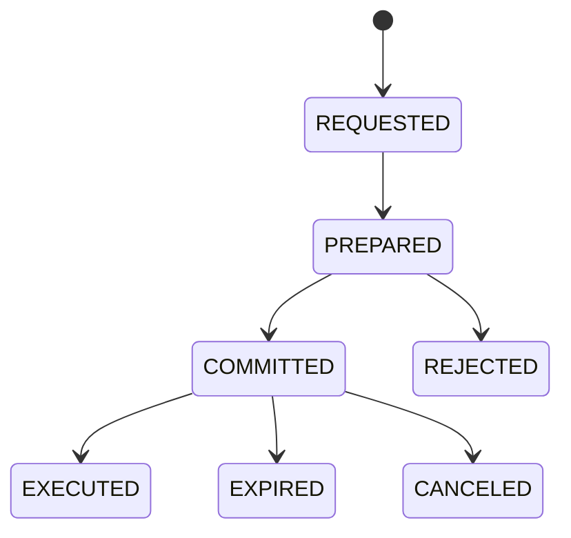

- Planning answers where a fragment should run
- Reservation answers whether that candidate can still be used now

---

## Coordination Protocol

- 1. Client submits a job
- 2. Circuit is normalized and fragmented
- 3. Planner assigns primary and fallback candidates
- 4. Orchestrator issues reservation request
- 5. Target node accepts or rejects
- 6. Runtime schedules ready DAG fragments
- 7. Node execution response is returned and persisted
- 8. Job state is updated and result is delivered through the API and job stream

### Key Clarification

- Discovery uses broadcast-style advertisements
- Fragment execution uses directed remote invocation
- Final job results are retrieved through API surfaces, not a hidden internal shortcut

---

## Persistence and Recovery

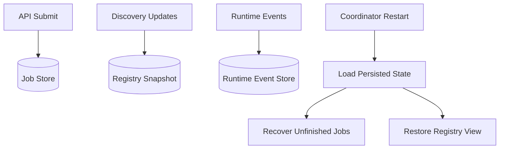

- The system persists more than final responses
- Stored state includes jobs, plans, results, runtime events, and registry snapshots
- This supports restart recovery, traceability, and evaluation workflows

---

## Reliability Features

- Deterministic planner for reproducible execution plans
- Fallback node execution when the preferred path fails
- Retry policies for transient failures
- Dependency-safe scheduling across fragment DAGs
- Discovery pruning for stale or unavailable services
- Persistent job recovery after coordinator restart

### Failure Scenarios Already Handled

- timeout
- execution rejection
- node drop
- quality degradation

---

## Quantum Result Pipeline

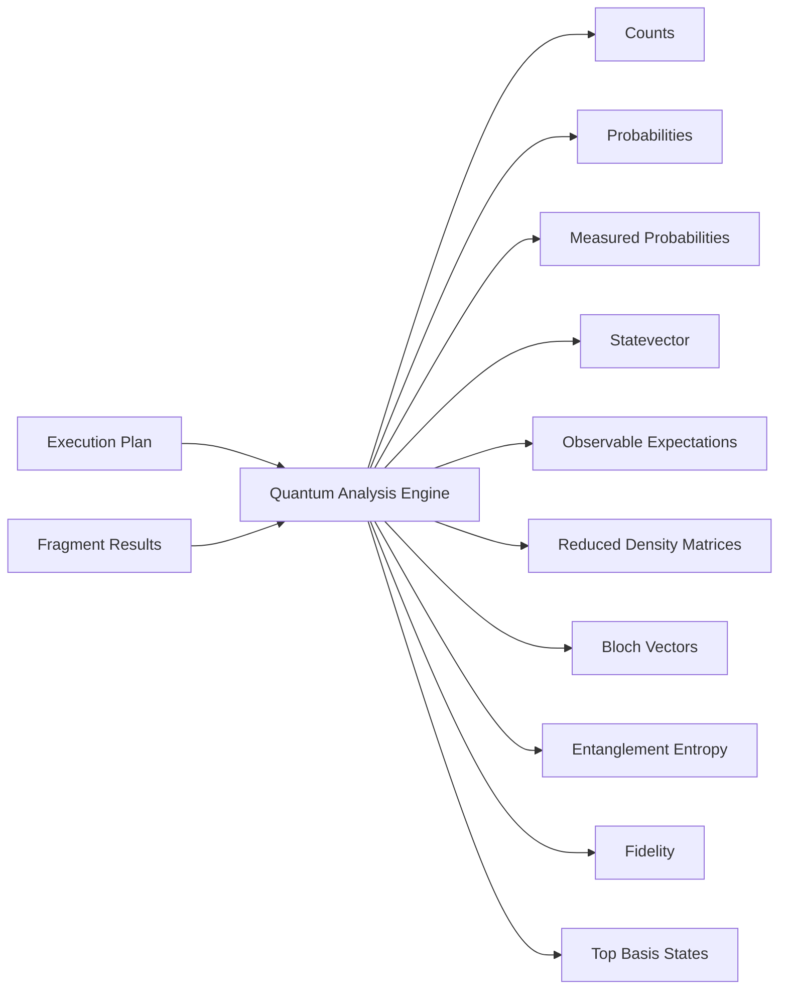

- Final output contains both execution truth and quantum interpretation
- This is useful for systems reviewers and quantum researchers

---

## Example Result Semantics

- `fragment_results` explain what happened operationally
- which node ran what
- how many attempts were required
- when execution started and ended
- what fidelity was observed
- `quantum_result` explains what happened quantum-mechanically
- sampled counts over measured qubits
- full pre-measurement basis probabilities
- statevector and subsystem analysis
- observables, entropy, fidelity, dominant basis states

### Important Distinction

- `counts` are sampled over measured qubits
- `probabilities` describe the full pre-measurement state
- `measured_probabilities` explain the exact measured marginal

---

## Observability

- Health and uptime endpoint
- Service registry view through API
- Fidelity snapshots per node
- Job-level status inspection
- Execution event persistence for post-mortem analysis
- WebSocket streaming for near-real-time job updates

### Why It Matters

- Supports debugging
- Supports demo transparency
- Supports research traceability

---

## Security Posture

- Currently implemented:
- API key authentication
- request rate limiting
- schema validation and payload size limits

### Future Hardening Directions

- stronger node identity verification
- signed service advertisements
- authenticated coordination channels

---

## What Is Implemented In This Proof Of Concept

- API service and WebSocket updates
- durable persistence and startup recovery
- service advertisement validation
- freshness-aware registry
- deterministic distributed planning
- reservation protocol
- dependency-safe runtime execution
- retry and fallback behavior
- peer-to-peer discovery and request streams
- quantum result interpretation

---

## What Is Intentionally Simplified

- `teleportation` is currently approximated as logical `SWAP`
- `syndrome_extraction` is treated as an orchestration-level step
- `distillation` is treated as an orchestration-level step
- fidelity is not yet a hardware-tomography measurement
- this is not yet a full hardware-backed quantum internet stack

### Why This Still Matters

- The distributed systems architecture is implemented
- The coordination substrate is implemented
- The orchestration and persistence layers are implemented
- The platform is already suitable for comparative research on orchestration strategies

---

## Architectural Advantages

- Decentralized coordination model
- Hardware and service heterogeneity
- Deterministic planning for reproducible experiments
- Fault tolerance through retry and fallback
- Durable lifecycle tracking and recovery
- Clear separation of control, execution, and data responsibilities

---

## Main Contribution

- Unifies quantum-service abstractions with distributed systems orchestration
- Uses a peer-to-peer coordination layer instead of assuming centralized transport
- Provides planning, reservation, execution, recovery, and persistence in one platform
- Returns detailed quantum interpretation after distributed execution
- Creates a research platform for studying how distributed quantum capabilities should be coordinated

---

## Conceptual Comparison

```text
workflow orchestration
        +
quantum circuit placement
        +
peer-to-peer service coordination
```

- Similar in spirit to combining a workflow scheduler, a quantum circuit orchestrator, and a distributed coordination fabric
- The value is in the combination, not any one component by itself

---

## Why This Is More Than A Simulator

- Not one circuit to one backend
- Not one in-process execution path
- Not only a quantum-state calculation
- It is:
- capability discovery
- service placement
- failure-aware orchestration
- persistent lifecycle management
- post-execution quantum analysis


## Thank You
