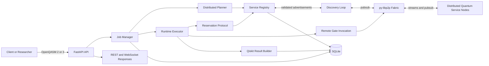

# Quantum Libp2p Coordinator

> Distributed quantum services over `py-libp2p`, orchestrated by FastAPI, planned as dependency graphs, executed with retries and fallback, and explained with Qiskit-backed quantum analysis.

This project is a research-oriented proof of concept for **distributed quantum services**.
Instead of treating a quantum workflow as a single monolithic backend call, it models quantum capabilities as **network-visible services** that can be:

- advertised over `py-libp2p`
- discovered and tracked by a coordinator
- selected by a cost-based planner
- reserved before execution
- invoked remotely over real libp2p streams
- analyzed with Qiskit after execution

The result is a system that looks less like a toy gate simulator and more like a serious coordination layer for **networked quantum capabilities**.

## Why It Matters

- **Distributed quantum services**: quantum operations are modeled as remotely invocable capabilities, not hardcoded local functions.
- **Real `py-libp2p` transport**: service discovery uses pubsub and execution uses direct request streams.
- **Planning, not blind dispatch**: circuits are parsed, normalized, fragmented, and mapped to service nodes with primary and fallback candidates.
- **Operational realism**: reservation state, fragment execution events, job lifecycle, and service snapshots are all persisted to SQLite.
- **Explainable results**: completed jobs return counts, probabilities, statevector, observables, reduced density matrices, Bloch vectors, entanglement entropy, fidelity, and dominant basis states.
- **Demo-ready API**: FastAPI endpoints, OpenAPI docs, WebSocket job updates, and an importable Postman collection are already included.

## End-to-End Workflow



## What The System Does Today

### Control Plane

- Accepts OpenQASM-like quantum circuits through FastAPI.
- Normalizes the circuit into internal IR.
- Builds a qubit dependency graph.
- Splits the workflow into executable fragments.
- Selects service nodes using a deterministic cost-based planner.
- Persists jobs, plans, reservations, runtime events, and registry state.

### Execution Plane

- Boots a real `py-libp2p` coordinator fabric.
- Starts embedded quantum service nodes for demo and integration runs.
- Advertises capabilities over pubsub.
- Invokes remote gate services over libp2p request streams.
- Applies retry, timeout, and fallback behavior at fragment granularity.

### Result Plane

- Reconstructs the executed plan as a Qiskit circuit.
- Returns `counts`, `probabilities`, `measured_probabilities`, and `statevector`.
- Computes `observable_expectations`, `reduced_density_matrices`, `bloch_vectors`, `entanglement_entropy`, `fidelity`, and `top_basis_states`.

## Supported Distributed Quantum Services

The current service vocabulary is:

- `bell_pair`
- `cnot`
- `cz`
- `teleportation`
- `syndrome_extraction`
- `distillation`
- `measurement_feedforward`

Input aliases such as `cx`, `cnot`, `teleport`, `teleportation`, `bell`, and `measure` are normalized to this service set.

## Quick Start

### Requirements

- Python `3.10+`
- [`uv`](https://github.com/astral-sh/uv)

### Install

```bash
make install
```

### Run the demo server

```bash
make demo
```

For a clean database:

```bash
make demo-clean
```

### Run in development mode

```bash
make run
```

### Useful URLs

- OpenAPI docs: `http://127.0.0.1:8080/docs`
- ReDoc: `http://127.0.0.1:8080/redoc`
- Health: `http://127.0.0.1:8080/api/v1/health`

## Try It With `curl`

### 1. Verify the coordinator

```bash
curl http://127.0.0.1:8080/api/v1/health
```

### 2. Inspect discovered services

```bash
curl http://127.0.0.1:8080/api/v1/services
```

### 3. Submit a distributed multi-step circuit

```bash
curl -X POST http://127.0.0.1:8080/api/v1/circuits/submit \
  -H 'Content-Type: application/json' \
  --data-binary '{
    "circuit": "OPENQASM 3;\nqubit[2] q;\nbit[1] c;\nbell_pair q[0], q[1];\ncnot q[0], q[1];\ncz q[0], q[1];\nteleport q[0], q[1];\nsyndrome_extraction q[0];\ndistillation q[1];\nmeasure q[0] -> c[0];"
  }'
```

### 4. Poll the job

```bash
curl http://127.0.0.1:8080/api/v1/jobs/<job_id>
```

### 5. Inspect the compiled plan

```bash
curl http://127.0.0.1:8080/api/v1/plans/<plan_id>
```

### 6. Inspect service fidelity metrics

```bash
curl http://127.0.0.1:8080/api/v1/metrics/fidelity/<node_id>
```

## Example Result Shape

Successful jobs return fragment-level execution metadata plus quantum analysis:

```json
{
  "status": "COMPLETED",
  "result": {
    "job_id": "job-...",
    "fragment_results": [
      {
        "fragment_id": "frag-0001",
        "node_id": "12D3KooW...",
        "status": "SUCCESS",
        "attempts": 1,
        "observed_fidelity": 0.97
      }
    ],
    "quantum_result": {
      "counts": {"0": 1024},
      "probabilities": {"00": 0.5, "10": 0.5},
      "measured_probabilities": {"0": 1.0},
      "statevector": ["0.707106781187+0j", "0j", "0.707106781187+0j", "0j"],
      "measured_qubits": [0],
      "observable_expectations": {
        "Z_q0": 1.0,
        "Z_q1": 0.0,
        "ZZ_q0_q1": 0.0,
        "XX_q0_q1": 0.0
      },
      "bloch_vectors": {
        "q0": {"x": 0.0, "y": 0.0, "z": 1.0},
        "q1": {"x": 1.0, "y": 0.0, "z": 0.0}
      },
      "entanglement_entropy": {
        "q0|rest": 0.0,
        "q1|rest": 0.0
      },
      "fidelity": {
        "target_state": "ideal_compiled_state",
        "fidelity_to_target_state": 1.0,
        "estimated_execution_fidelity": 0.807982844781
      }
    }
  }
}
```

## API Surface

| Endpoint | Purpose |
| --- | --- |
| `GET /api/v1/health` | health and uptime |
| `POST /api/v1/circuits/submit` | submit a circuit for distributed execution |
| `GET /api/v1/jobs/{job_id}` | fetch job status and results |
| `GET /api/v1/plans/{plan_id}` | inspect the compiled execution plan |
| `GET /api/v1/services` | list discovered service advertisements |
| `GET /api/v1/metrics/fidelity/{node_id}` | inspect per-node fidelity snapshot |
| `WS /api/v1/jobs/{job_id}/ws` | stream job status changes |

## Developer Commands

```bash
make install   # install runtime + dev dependencies with uv
make lint      # ruff + mypy
make format    # ruff format
make test      # pytest
make run       # uvicorn with reload
make demo      # curated demo startup
make demo-clean
```

## Configuration

Start from [`config/config.example.yaml`](config/config.example.yaml).

You can pass configuration either by file or by environment overrides:

```bash
QC_CONFIG_FILE=config/config.example.yaml uv run uvicorn quantum_coordinator.asgi:app --host 0.0.0.0 --port 8080
```

Examples:

```bash
QC_API__PORT=9000
QC_LOGGING__LEVEL=DEBUG
QC_LIBP2P__ENABLED=true
QC_LIBP2P__COORDINATOR_LISTEN_ADDRS='["/ip4/127.0.0.1/tcp/9100"]'
```

Important runtime note:

- if `libp2p.enabled` is `true` and libp2p bootstrap fails, the API **fails startup**
- if you explicitly disable libp2p, the app can use the local in-process gate adapter for development

## Project Layout

```text
src/quantum_coordinator/
  api/                 FastAPI routes and response models
  application/         job manager and bootstrap wiring
  config/              typed configuration models and loader
  domain/              shared enums and domain types
  infra/libp2p/        py-libp2p fabric, adapters, protocols
  infra/persistence/   SQLite stores and migrations
  planning/            parser, DAG builder, fragments, planner, cost model
  reservation/         reservation protocol and state machine
  runtime/             executor, gate adapter, Qiskit result builder
  service_discovery/   advertisement validation, discovery loop, registry
tests/
docs/
postman.json
architecture.md
```

## Documentation Map

- [`architecture.md`](architecture.md): deep technical walk-through of the full system
- [`docs/design.md`](docs/design.md): design rationale and milestone framing
- [`docs/requirements.md`](docs/requirements.md): functional and non-functional requirements
- [`docs/tasks.md`](docs/tasks.md): milestone plan and exit criteria
- [`postman.json`](postman.json): importable API collection with example requests

## Current Status

Implemented today:

- real `py-libp2p` coordinator fabric with embedded service nodes
- FastAPI API with REST + WebSocket job updates
- SQLite persistence and startup recovery
- service discovery and freshness-aware registry
- deterministic distributed planner with fallback candidates
- reservation protocol and dependency-safe runtime execution
- real end-to-end execution over libp2p request streams
- Qiskit-backed post-execution quantum analysis

Planned next:

- centralized baseline for apples-to-apples benchmark comparison
- experiment harness and exportable evaluation artifacts
- richer protocol semantics for advanced distributed quantum workflows

## Important Modeling Note

This repository demonstrates **distributed quantum service orchestration**.
It does **not** yet implement a full hardware-backed quantum network stack.

Current semantics:

- `teleportation` is approximated as a logical `SWAP` for Qiskit state evolution
- `syndrome_extraction` and `distillation` are treated as orchestration-level steps because the current DSL does not yet encode ancillas and full classical feedback semantics

That means the coordinator, planning, libp2p transport, persistence, and orchestration logic are real, while some higher-level quantum service semantics are intentionally simplified for the proof of concept.
