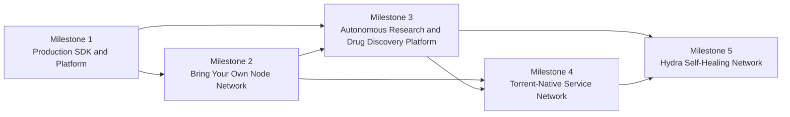

# Future Roadmap: From Quantum Coordination POC to Autonomous Scientific Network

Back to [Docs Index](README.md)

## Use this document when

- you need the long-term direction and milestone narrative
- you want milestone ordering rationale before reading details
- you are aligning strategy discussions across engineering and product

This document is the long-horizon product and platform roadmap for the project.

It is intentionally different from [tasks.md](tasks.md).

- [tasks.md](tasks.md) is the near-term implementation plan for the current proof of concept
- this roadmap is the multi-milestone future plan for what the project grows into

## How To Read This Roadmap

Start here for the big picture, then move into the detailed milestone docs:

1. [Program sequencing and dependency plan](future-roadmap/00-sequencing-and-program-plan.md)
2. [Milestone 1: Production SDK and Platform](future-roadmap/01-production-sdk-and-platform.md)
3. [Milestone 2: Bring Your Own Node Network](future-roadmap/02-bring-your-own-node-network.md)
4. [Milestone 3: Autonomous Research and Drug Discovery Platform](future-roadmap/03-autonomous-research-and-drug-discovery-platform.md)
5. [Milestone 4: Torrent-Native Service Network](future-roadmap/04-torrent-native-service-network.md)
6. [Milestone 5: Hydra Self-Healing Network](future-roadmap/05-hydra-self-healing-network.md)

## Roadmap Thesis

The future of this project is not only to orchestrate distributed quantum services.

The real destination is much larger:

- first, become a production-ready developer platform for distributed compute and orchestration
- then, let anyone contribute devices as peers in the network
- then, turn that network into a serious scientific execution and discovery platform
- then, evolve the network into a torrent-inspired service and artifact swarm
- finally, make the whole system resilient enough to survive node, service, and coordinator loss without collapsing

That means the project evolves across five identities:

1. a **platform**
2. a **network**
3. a **research engine**
4. a **service swarm**
5. a **self-healing distributed organism**

## Roadmap At A Glance

| Milestone | Theme | Core Question | End State |
| --- | --- | --- | --- |
| M1 | Production SDK and Platform | Can external developers and teams reliably build on it? | stable SDKs, platform APIs, operator UX, production deployment model |
| M2 | Bring Your Own Node Network | Can any device become a trusted peer? | laptops, phones, workstations, and edge devices join as nodes |
| M3 | Autonomous Research and Drug Discovery Platform | Can the platform itself perform high-value scientific discovery workflows? | domain workflows for labs, simulation, and drug discovery |
| M4 | Torrent-Native Service Network | Can the network distribute services and artifacts like a swarm, not just route requests? | service packages, dataset swarms, peer-assisted distribution |
| M5 | Hydra Self-Healing Network | Can the network survive failure by regenerating itself? | multi-coordinator, replicated, self-healing orchestration fabric |

## Why This Order Matters

This sequence is deliberate.

- M1 creates the contracts, security model, and operator surfaces that every later milestone depends on
- M2 turns the platform into a real network instead of a coordinator plus embedded demo nodes
- M3 gives the network a high-value purpose: scientific reasoning, discovery, and lab workflows
- M4 scales distribution so the network can move services, models, datasets, and execution bundles efficiently
- M5 makes the full system resilient enough to operate as critical distributed infrastructure

If the order is reversed, the project risks building a grand architecture with no usable platform, no trustworthy node model, and no real-world workload pull.

## North-Star Outcomes

By the end of the full roadmap, the project should be able to do all of the following:

- expose a stable SDK and platform for distributed scientific workloads
- let users contribute their own devices as execution nodes
- execute real research pipelines for drug discovery, simulation, and lab operations
- distribute service packages, models, and artifacts through a swarm-like network layer
- recover from node and coordinator failure automatically
- keep scientific execution reproducible, inspectable, and explainable

## Guiding Principles

### 1. Platform before hype

Every visionary capability must sit on a stable developer and operator foundation.

### 2. Network participation must be easy

If joining as a node takes expert knowledge, the network will never scale.

### 3. Scientific credibility matters more than flashy demos

For the research platform to matter, it must produce reproducible outputs, defensible provenance, and measurable discovery value.

### 4. Decentralization should add capability, not confusion

The network layer should improve scale, resilience, and reach, not make the product harder to trust.

### 5. Resilience must become native

The final form of the system should not simply survive failures. It should route around them and recover automatically.

## Dependency Graph

## Recommended Navigation

If you want different levels of detail:

- for the full big-picture view: stay on this page, then read the [program sequencing and dependency plan](future-roadmap/00-sequencing-and-program-plan.md)
- for product strategy detail: start with [Milestone 1](future-roadmap/01-production-sdk-and-platform.md) and [Milestone 3](future-roadmap/03-autonomous-research-and-drug-discovery-platform.md)
- for distributed systems depth: focus on [Milestone 2](future-roadmap/02-bring-your-own-node-network.md), [Milestone 4](future-roadmap/04-torrent-native-service-network.md), and [Milestone 5](future-roadmap/05-hydra-self-healing-network.md)
- for an execution sequence: use the [program sequencing and dependency plan](future-roadmap/00-sequencing-and-program-plan.md)

## Relationship To Existing POC Docs

These existing documents still matter:

- [ARCHITECTURE.md](ARCHITECTURE.md): what the current system is
- [design.md](design.md): why the proof of concept was shaped the way it was
- [requirements.md](requirements.md): what the current POC is meant to satisfy
- [tasks.md](tasks.md): the near-term implementation plan for the present codebase

This roadmap starts where those documents stop.

It is the answer to:

- what the platform becomes after the current POC hardens
- what features belong in the next era of the project
- how the system grows from a research prototype into a distributed scientific platform

