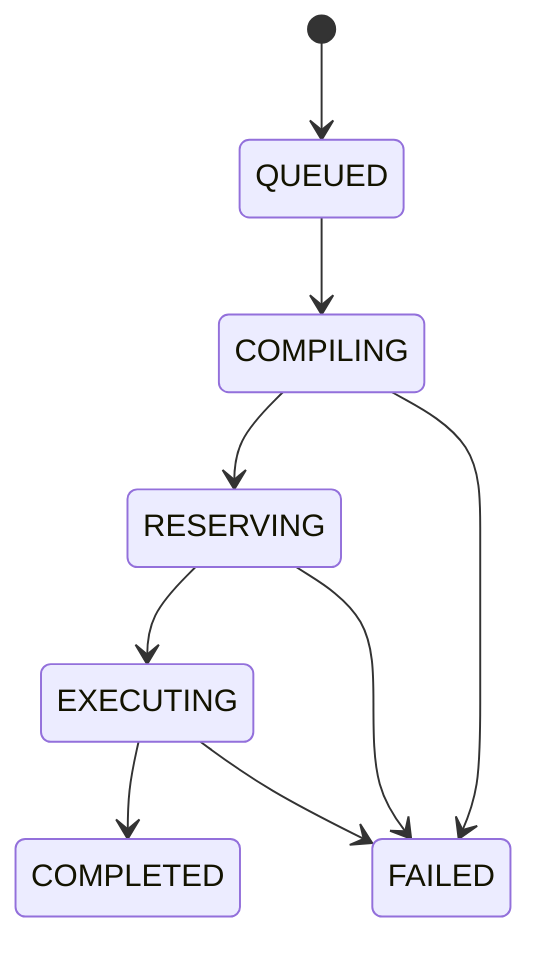
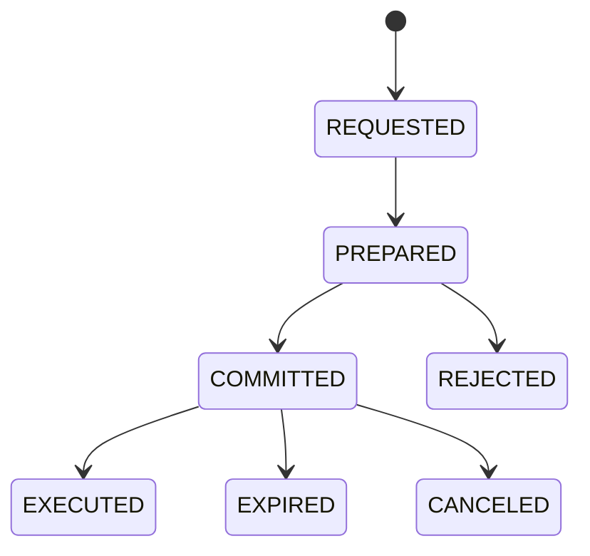

# Design Document: Distributed Quantum Services (Python POC)

Back to [Docs Index](README.md)

## Use this document when

- you want design rationale and intended boundaries
- you are evaluating tradeoffs, risks, and open questions
- you need protocol and state model references

## 1. Design Goals

This design targets a publishable proof-of-concept where:
- `py-libp2p` is the coordination substrate.
- Quantum capabilities are represented as remotely invocable services.
- A coordinator compiles and orchestrates distributed execution with robustness under degradation.

Primary objectives:
1. Demonstrate distributed coordination primitives for remote quantum operations.
2. Quantify tradeoffs against centralized orchestration.
3. Keep implementation realistic for a single Python codebase.

Related requirements: FR-001..FR-014, NFR-001..NFR-005.

## 2. Non-Goals

- Real hardware control drivers.
- Multi-coordinator consensus protocols.
- Full production security model.
- Advanced fault-tolerant quantum error correction workflows.

## 3. Architecture Overview

We separate the system into three planes:

- **Control Plane**: discovery, registry, compilation, reservation.
- **Execution Plane**: gate invocation runtime on service nodes.
- **Data Plane**: persistence, metrics, logs, experiment outputs.

```mermaid
graph TD
    Client[Client/API User] --> API[FastAPI Layer]
    API --> JobMgr[Job Manager]
    JobMgr --> Compiler[Distributed Compiler]
    Compiler --> Registry[Service Registry]
    JobMgr --> Runtime[Runtime Orchestrator]
    Runtime --> Reservation[Reservation Protocol]
    Runtime --> GateExec[Gate Execution Protocol]

    Registry <--> Discovery[Libp2p Discovery Adapter]
    Discovery <--> ServiceNodes[Service Nodes]

    Runtime --> Monitor[Fidelity/Link Monitor]
    Monitor --> Registry

    JobMgr --> DB[(SQLite)]
    Registry --> DB
    Reservation --> DB
    Monitor --> DB

    JobMgr --> Experiments[Experiment Harness]
```



Key design principle: all libp2p-specific code is behind adapter interfaces so core logic remains testable and resilient to library API churn.

## 4. Core Components

### 4.1 API Layer

Responsibilities:
- Accept circuit submissions.
- Expose job status and result retrieval.
- Expose services, metrics, and health endpoints.
- Optionally stream job updates via websocket.

Primary endpoints:
- `POST /api/v1/circuits/submit`
- `GET /api/v1/jobs/{job_id}`
- `GET /api/v1/services`
- `GET /api/v1/metrics/fidelity/{node_id}`
- `GET /api/v1/health`

Related requirements: FR-003, FR-009, FR-012, FR-014.

### 4.2 Job Manager

Responsibilities:
- Persist submitted jobs immediately.
- Drive lifecycle: `QUEUED -> COMPILING -> RESERVING -> EXECUTING -> COMPLETED|FAILED`.
- Maintain queue priority and concurrency limits.
- Attach correlation IDs for observability.

Related requirements: FR-009, FR-010, FR-012.

### 4.3 Service Discovery + Registry

Responsibilities:
- Receive capability advertisements.
- Keep freshness with TTL and heartbeat updates.
- Provide filtered queries to compiler/runtime.

Design notes:
- Discovery transport is libp2p pubsub + direct lookup helpers.
- Registry is local authoritative cache backed by SQLite snapshot.
- Registry records both current state and historical transitions.

Related requirements: FR-001, FR-002, FR-008, FR-010.

### 4.4 Distributed Compiler

Responsibilities:
- Parse normalized circuit IR into dependency DAG.
- Partition DAG into executable fragments.
- Assign fragments to service nodes with a configurable cost model.

### Cost Model

For a candidate mapping `m`:

`cost(m) = w_lat * latency(m) + w_fail * failure_risk(m) + w_ent * entanglement_overhead(m) + w_load * load_penalty(m)`

Where:
- `latency(m)`: estimated orchestration + network delay.
- `failure_risk(m)`: derived from `1 - fidelity` and historical timeout rate.
- `entanglement_overhead(m)`: predicted remote link setup burden.
- `load_penalty(m)`: soft penalty for overloaded nodes.

Compiler picks minimum-cost feasible mapping satisfying hard constraints:
- required gate/service availability
- minimum fidelity threshold
- qubit capacity constraints

Related requirements: FR-004, FR-008, NFR-001.

### 4.5 Reservation Protocol

Responsibilities:
- Reserve execution windows before invoking remote operations.
- Avoid race/conflict between concurrent jobs.
- Support cancellation and expiration cleanup.

Protocol pattern (POC): two-step handshake
1. `PREPARE`: check feasibility for time window + fidelity constraint.
2. `COMMIT`: lock reservation for execution.

If any fragment reservation fails, runtime may re-plan/fallback or abort.

Related requirements: FR-005, FR-007, FR-010.

### 4.6 Runtime Orchestrator

Responsibilities:
- Execute fragments in topological dependency order.
- Apply timeout/retry policies.
- Trigger fallback path on retry exhaustion.
- Record detailed fragment outcomes.

Related requirements: FR-006, FR-007, FR-008.

### 4.7 Fidelity and Link Monitor

Responsibilities:
- Ingest quality updates from service nodes.
- Persist time-series metrics.
- Mark degraded entities and notify planner/runtime.

Related requirements: FR-008, FR-010, FR-012.

### 4.8 Persistence Layer

SQLite stores:
- jobs and state transitions
- service registry snapshots
- reservations
- fidelity/link metrics
- experiment runs and benchmark outputs

Migration tool (e.g., Alembic) version-controls schema evolution.

Related requirements: FR-010, FR-013.

## 5. Protocol Contracts

This section defines message-level contracts, independent of serialization format.

### 5.1 Service Advertisement

Fields:
- `protocol_version`
- `node_id`
- `service_type`
- `fidelity` (0.0..1.0)
- `qubit_min`, `qubit_max`
- `availability`
- `updated_at`

Validation rules:
- Reject if missing required field.
- Reject if fidelity/qubit range invalid.
- Reject if protocol version unsupported.

### 5.2 Reservation Messages

`ReservationRequest`:
- `request_id`
- `job_id`
- `fragment_id`
- `service_type`
- `window_start`, `window_end`
- `min_fidelity`

`ReservationResponse`:
- `request_id`
- `accepted` (bool)
- `reservation_id` (if accepted)
- `reason` (if rejected)
- `suggested_window` (optional)

### 5.3 Gate Execution Messages

`GateInvokeRequest`:
- `job_id`, `fragment_id`, `reservation_id`
- operation parameters and input references

`GateInvokeResponse`:
- `fragment_id`
- `status`
- `measurements` (if applicable)
- `duration_ms`
- `observed_fidelity`
- `error` (optional)

## 6. State Machines

### 6.1 Job State Machine



Invariant:
- No backward transitions.
- Every terminal state has persisted reason/result payload.

### 6.2 Reservation State Machine



Invariant:
- `EXECUTED|EXPIRED|CANCELED|REJECTED` are terminal.

## 7. Compilation and Planning Flow

1. Parse input to internal IR.
2. Build operation DAG.
3. Fragment DAG by operation locality and service type.
4. Query registry for feasible candidate nodes per fragment.
5. Score candidates via cost model.
6. Select mapping and derive required remote links.
7. Emit execution plan with fallback candidates.

Plan schema:
- `plan_id`
- `fragments[]`
- `dependencies`
- `primary_assignment`
- `fallback_assignments`
- `quality_snapshot_id`

## 8. Runtime Execution Strategy

Execution loop:
1. Reserve fragments for current ready set.
2. Invoke service operations.
3. Persist outcomes and update progress.
4. On timeout/error:
- retry with backoff until max retry
- if exhausted, attempt fallback assignment
- if fallback infeasible, fail job with fragment-level cause

Backoff default:
- attempt 1: 200ms
- attempt 2: 400ms
- attempt 3: 800ms
(max configurable)

## 9. Failure Model and Recovery

Failure classes:
1. **Validation**: malformed input/contract mismatch.
2. **Transient transport**: network timeout, stream reset.
3. **Resource**: no reservation window, overloaded node.
4. **Quality degradation**: fidelity or link quality below threshold.
5. **Fatal**: impossible mapping or repeated terminal failures.

Recovery policy:
- validation/fatal -> fail fast
- transient/resource -> retry then fallback
- quality degradation -> re-score candidates and migrate remaining fragments if safe

## 10. Data Model (SQLite)

Core tables:
- `jobs`
- `job_events`
- `service_nodes`
- `service_ads`
- `reservations`
- `fragment_executions`
- `quality_metrics`
- `experiment_runs`
- `experiment_results`

Suggested indexes:
- `jobs(status, submitted_at)`
- `service_ads(service_type, availability, updated_at)`
- `quality_metrics(node_id, service_type, timestamp)`
- `reservations(job_id, status)`

## 11. Configuration Model

Top-level config sections:
- `api`
- `libp2p`
- `planning`
- `runtime`
- `quality`
- `database`
- `experiments`

Critical config keys:
- discovery TTL and refresh interval
- cost weights (`w_lat`, `w_fail`, `w_ent`, `w_load`)
- per-operation timeout and retry policy
- degradation thresholds
- queue concurrency and API rate limits

## 12. Observability

Logs:
- JSON structured logs with `job_id`, `fragment_id`, `node_id`, `request_id`.

Metrics:
- compile latency, reservation latency, execution latency
- retry count and fallback count
- success/failure rates by service type
- queue depth and processing rate

Tracing (optional in POC):
- span per job and fragment execution path.

## 13. Security Baseline

- Optional API key auth.
- Input size limits and schema validation.
- Rate limiting per client identifier.
- Do not execute arbitrary code from circuit payloads.

## 14. Experiment and Evaluation Design

Goal: produce reproducible comparisons between distributed and centralized coordination.

Benchmark dimensions:
- circuit size: small/medium/large
- network latency: low/medium/high
- failure injection: none/intermittent/sustained
- quality drift: stable/degrading

For each run capture:
- compile time
- total job completion latency
- success rate
- retries/fallbacks
- estimated final fidelity

Output artifacts:
- CSV/JSON raw metrics
- summary notebook/script for statistical comparison
- reproducible run config snapshot

Related requirements: FR-013, NFR-003.

## 15. Suggested Python Package Structure

```text
src/quantum_coordinator/
  api/
  application/
  domain/
  infra/libp2p/
  infra/persistence/
  planning/
  runtime/
  monitoring/
  experiments/
  config/
```

Design rule:
- `domain/` and `planning/` must not import libp2p directly.
- libp2p specifics stay in `infra/libp2p/` adapters.

## 16. Key Risks and Mitigations

1. **Risk**: py-libp2p API instability.
- Mitigation: strict adapter interface + integration tests around adapters.

2. **Risk**: Overfitting cost model to synthetic workloads.
- Mitigation: evaluate across multiple workload families and publish config.

3. **Risk**: Retry storms during partial outages.
- Mitigation: jittered bounded backoff + global concurrency caps.

4. **Risk**: Registry staleness causing bad assignments.
- Mitigation: TTL enforcement + pre-invocation quality check.

## 17. Open Questions

1. Should reservation use strict two-phase lock semantics or optimistic reservations for throughput?
2. Should the POC include coordinator hot-standby now or defer to post-POC?
3. Which benchmark suite is primary for publication: random DAGs, QAOA, or teleportation-heavy circuits?

## 18. Requirement Traceability Summary

- Discovery/registry: FR-001, FR-002, FR-008, FR-010
- Planning/compiler: FR-004, FR-008, NFR-001
- Reservation/runtime: FR-005, FR-006, FR-007
- API + ops: FR-009, FR-011, FR-012, FR-014
- Evaluation: FR-013, NFR-003
